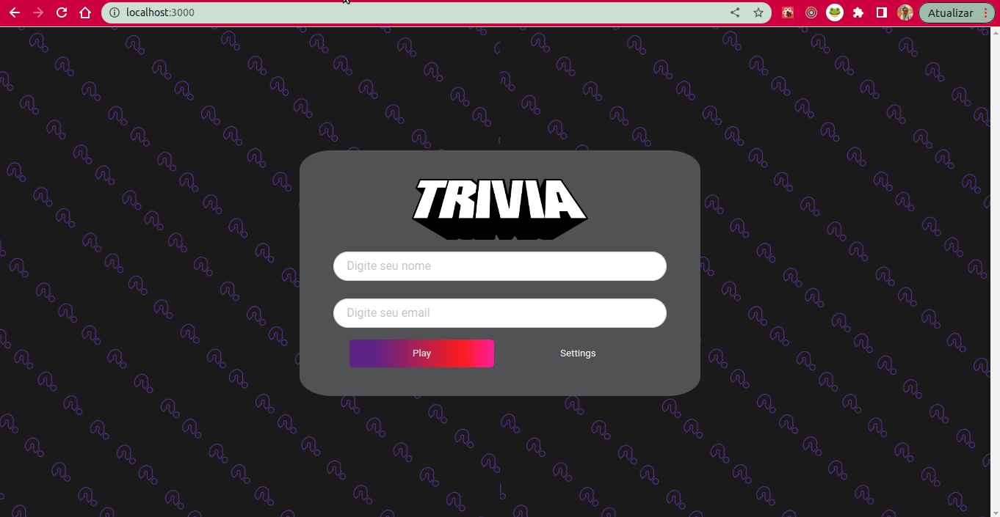

# Boas-vindas ao repositório do projeto de Trivia!

<strong>O que foi desenvolvido</strong>
 
  Foi desenvolvido um jogo de perguntas e respostas baseado no jogo **Trivia** utilizando _React e Redux_;

O que a aplicação faz?

  - Tem tela de Login, onde depois do cadastro, se o email tivesse cadastro no site[Gravatar], a foto de perfil aparece no header da próxima page.
  - Na Tela de Game, é possivél escolher uma das respostas disponíveis para cada uma das perguntas apresentadas. A resposta tem que ser marcada antes do contador de tempo chegar a zero, caso contrário a resposta é considerada errada.
  - Após as 5 perguntas respondidas, a pessoa usuaria é redirecionada para a tela de score, onde o texto mostra o número de acertos.
  - É possivel ver a page de ranking, se quiser, ao final de cada jogo.

<strong>Para clonar e testar</strong>
 

1. Clone o repositório
* `git clone git@github.com:georgia-rocha/trivia-react-redux.git`
* Entre na pasta do repositório que você acabou de clonar:

2. Instale as dependências:
* `npm install`

3. Iniciar a aplicação na sua máquina:
  * `npm start`

<strong>Pontos importantes</strong>
 

* Esse Projeto foi o primeiro do módulo de Front-end realizado em grupo, o que foi muito importante para nossa adaptação a realidade do mercado, conhecemos novas ferramentas que facilitaram nosso projeto, como o trello;
* Foram feitas daily meeting para organização e produção do projeto, a maior parte do projeto foi feito em pair programming, mas o time sempre estava disponivel para resolucionar problemas quando apareciam;
* Os teste ficaram em 81%, mas ainda planejo conseguir os 95%, para fechar os 100%;

Parte que desenvolvi:

* Fiquei responsavél pelo css e pela criação da page Game em conjunto com outro participante do time, maior dificuldade foi o requisito 8, pois estava alterando o funcionamento de outros requisitos;

# Requisitos Obrigatórios 100%

- [x] 1. Crie a tela de login, onde a pessoa que joga deve preencher as informações para iniciar um jogo

- [x] 2. Crie o botão de iniciar o jogo

- [x] 3. Crie um botão que leva a pessoa para tela de configuração

- [x] 4. Desenvolva testes para atingir 90% de cobertura da tela de Login

- [x] 5. Crie um _header_ que deve conter as informações da pessoa jogadora

- [x] 6. Crie a página de jogo que deve conter as informações relacionadas à pergunta

- [x] 7. Desenvolva o estilo que, ao clicar em uma resposta, a correta deve ficar verde e as incorretas, vermelhas

- [x] 8. Desenvolva um timer onde a pessoa que joga tem 30 segundos para responder

- [x] 9. Crie o placar com as seguintes características:

- [x] 10. Crie um botão de `Next` que apareça após a resposta ser dada

- [x] 11. Desenvolva o jogo de forma que a pessoa jogadora deve responder 5 perguntas no total

- [x] 12. Desenvolva o header de _feedback_ que deve conter as informações da pessoa jogadora

- [x] 13. Crie a mensagem de _feedback_ para ser exibida a pessoa usuária

- [x] 14. Exiba as informações relacionadas aos resultados obtidos para a pessoa usuária

- [x] 15. Crie a opção para a pessoa jogadora poder jogar novamente

- [x] 16. Crie a opção para a pessoa jogadora poder visualizar a tela de _ranking_

- [x] 17. Desenvolva testes para atingir 90% de cobertura da tela de Feedbacks

## Tela de ranking

>Obs: É necessário que a página de Ranking tenha o caminho `src/pages/Ranking.js`

- [x] 18. Crie um botão para ir ao início

- [x] 19. Crie o conteúdo da tela de _ranking_

- [x] 20. Desenvolva testes para atingir 90% de cobertura da tela de Ranking
